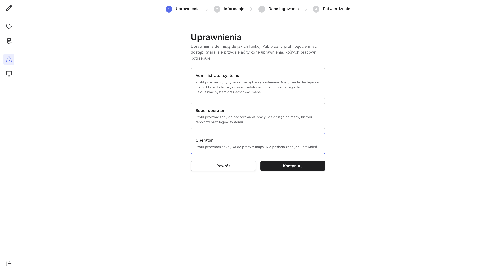

# Pablo - Emergency Tracking System

## Introduction

I want to share my recent project because I'm proud of it. Along with my friend @memorte03 (Frontend Dev + UI/UX), in two person team we created an emergency tracking system for Novatel and i3p from scratch. This system tracks blue-collar workers in real-time, both outdoors (3D view with GPS tracking) and indoors (Bluetooth beacons). The backend technology stack includes NestJS, GraphQL, PostgreSQL, and RabbitMQ in dockerized microservices.

## Challenges

- **Real-time tracking**: We had to track workers in real-time, both outdoors and indoors. We used GPS for outdoors and Bluetooth beacons for indoors. We used a custom algorithm to calculate the position of the workers based on the signal strength of the beacons. For Real-time communication we used WebSockets on GraphQL subscriptions.
- **3D view**: We had to show the position of the workers in a 3D view. We used ThreeJS to create a 3D map and we used the GPS coordinates to show the position of the workers.
- **Getting location data**: Workers use radios to communicate with eachother, so we had to get the location data from the radios. Radios also communicates with "router" with we comuniate by one of the microservices. Data is provided on UDP on hardware producent custom protocol. Next, when we have parsed data (JSON format instead of binary) we send it to RabbitMQ to rest of the system.
- **Indoor tracking**: We had to track workers indoors. To see where are workers and to display it properly on 3D map we use relation between three.js objects and beacons. We use signal strength to calculate distance between beacon and radio. 

## Quick Disclaimer

Code is not available because it's a commercial project.

<!-- 

-rw-r--r--@  1 szymon  staff   1.2M Oct 16 23:45 pablo-alarm-1.png
-rw-r--r--@  1 szymon  staff   985K Oct 16 23:45 pablo-alarm-2.png
-rw-r--r--@  1 szymon  staff   485K Oct 16 23:45 pablo-alarm-3.png
-rw-r--r--@  1 szymon  staff   519K Oct 16 23:45 pablo-alarm-4.png
-rw-r--r--@  1 szymon  staff   505K Oct 16 23:45 pablo-alarm-5.png
-rw-r--r--@  1 szymon  staff   830K Oct 16 23:45 pablo-alarm-6.png
-rw-r--r--@  1 szymon  staff   622K Oct 16 23:45 pablo-alarm-7.png
-rw-r--r--@  1 szymon  staff   596K Oct 16 23:45 pablo-alarm-8.png
-rw-r--r--@  1 szymon  staff   592K Oct 16 23:45 pablo-alarm-9.png
-rw-r--r--@  1 szymon  staff   527K Oct 16 23:45 pablo-beacon-osoba-1.png
-rw-r--r--@  1 szymon  staff   254K Oct 16 23:45 pablo-dodano-groupe.png
-rw-r--r--@  1 szymon  staff   466K Oct 16 23:45 pablo-dodawanie-beacona.png
-rw-r--r--@  1 szymon  staff   295K Oct 16 23:45 pablo-dodawanie-groupy-bez-danych.png
-rw-r--r--@  1 szymon  staff   281K Oct 16 23:45 pablo-dodawanie-groupy-z-danymi.png
-rw-r--r--@  1 szymon  staff   341K Oct 16 23:45 pablo-dodawanie-radio-wybor-groupy.png
-rw-r--r--@  1 szymon  staff   303K Oct 16 23:45 pablo-dodawanie-radiotelefonu.png
-rw-r--r--@  1 szymon  staff   285K Oct 16 23:45 pablo-dodawnie-groupy-2.png
-rw-r--r--@  1 szymon  staff   260K Oct 16 23:45 pablo-groupy.png
-rw-r--r--@  1 szymon  staff   253K Oct 16 23:45 pablo-grupy-brak-group.png
-rw-r--r--@  1 szymon  staff   309K Oct 16 23:45 pablo-historia-alarmów.png
-rw-r--r--@  1 szymon  staff   469K Oct 16 23:45 pablo-konfiguracja-beacona.png
-rw-r--r--@  1 szymon  staff   1.3M Oct 16 23:45 pablo-konfiguracja-mapy.png
-rw-r--r--@  1 szymon  staff   509K Oct 16 23:45 pablo-konfiguracja-piętra.png
-rw-r--r--@  1 szymon  staff   253K Oct 16 23:45 pablo-logowanie.png
-rw-r--r--@  1 szymon  staff   1.3M Oct 16 23:45 pablo-mapka-2.png
-rw-r--r--@  1 szymon  staff   1.2M Oct 16 23:45 pablo-mapka-operator-1.png
-rw-r--r--@  1 szymon  staff   272K Oct 16 23:45 pablo-osoba-szczegóły.png
-rw-r--r--@  1 szymon  staff   505K Oct 16 23:45 pablo-pietro-1.png
-rw-r--r--@  1 szymon  staff   237K Oct 16 23:45 pablo-profile-1.png
-rw-r--r--@  1 szymon  staff   243K Oct 16 23:45 pablo-profile-2.png
-rw-r--r--@  1 szymon  staff   293K Oct 16 23:45 pablo-radiotelefony-lista.png
-rw-r--r--@  1 szymon  staff   273K Oct 16 23:45 pablo-radiotelefony.png
-rw-r--r--@  1 szymon  staff   546K Oct 16 23:45 pablo-sms-wysłany.png
-rw-r--r--@  1 szymon  staff   529K Oct 16 23:45 pablo-system-1.png
-rw-r--r--@  1 szymon  staff   368K Oct 16 23:45 pablo-tworzenie-profilu-1.png
-rw-r--r--@  1 szymon  staff   368K Oct 16 23:45 pablo-tworzenie-profilu-2.png
-rw-r--r--@  1 szymon  staff   289K Oct 16 23:45 pablo-tworzenie-profilu-3.png
-rw-r--r--@  1 szymon  staff   277K Oct 16 23:45 pablo-tworzenie-profilu-4.png
-rw-r--r--@  1 szymon  staff   329K Oct 16 23:45 pablo-tworzenie-profilu-5.png
-rw-r--r--@  1 szymon  staff   537K Oct 16 23:45 pablo-wysyłanie-sms.png

 -->

## Images

